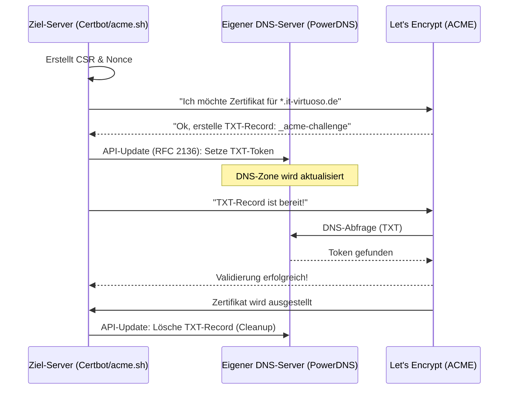
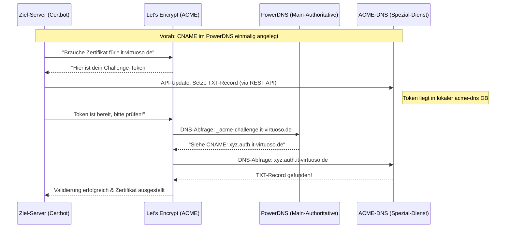

# Let's Encrypt Wildcard-Zertifikate via ACME-DNS

Die DNS-01 Challenge ist die sauberste Methode, um SSL-Zertifikate zu generieren, besonders für interne Dienste im LAN oder für Wildcard-Zertifikate (`*.it-virtuoso.de`). Der große Vorteil: Der Webserver muss nicht über Port 80/443 aus dem Internet erreichbar sein.

## Funktionsweise (Sequenzdiagramm)

Der Prozess nutzt einen temporären DNS-TXT-Eintrag zur Validierung der Inhaberschaft.

